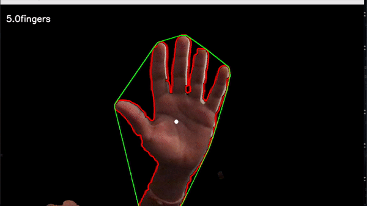

# AirCanvas-FingerTipTracking
Hand isolation, Finger counting, and finger point tracking in Python with OpenCV

## How to Run It

To run just type this command

```
python camera_feed.py
```

1. Face the camera towards a relatively clear/consistent background
2. Press 's' to capture the empty background. Don't put your hand in the frame when you do this
3. Place hand so it covers all 9 green boxes and press 'a'
      This captures the skintones of your hand. Histogram back projection is then used to isolate the hand in the frame
4. Remove hand from frame and press 's' once again. Optional but I had better results this way
5. Press 'c' to start drawing contours and counting fingers
6. Put up a single finger to draw gestures.

To clear your gesture at any time, press 'g'


## Demo

### Finger Point Tracking




### Finger Counting


